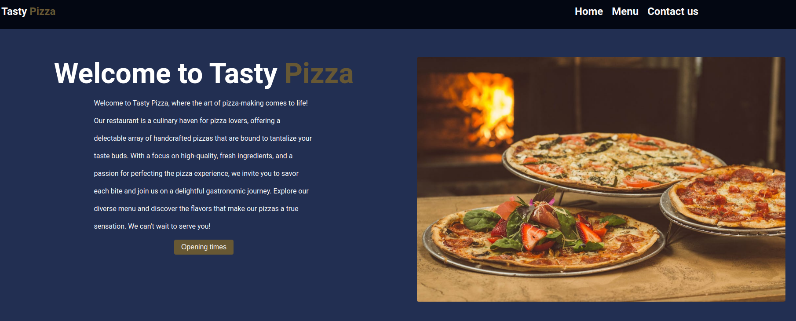

# Restaurant-Page
Live Demo &#128073; https://masecurity.github.io/Restaurant-Page/
## What is this project about?

 
This project is about a fictional restaurant page named Tasty Pizza, which offers a wide variety of Pizzas as well as some desserts and drinks, This project was built using not only HTML,CSS and JavaScript, but also webpack, a module bundler which takes all my code in the src directory, that is comprised of multiple files and bundles it into one file (main.js), outputting it to the dist directory, webpack is beneficial in the sense that it reduces the number of requests and loading speed.

## What i learned
- DOM Manipulation
- ES6 Modules
- NPM
- Source maps
- Webpack
## Dependencies
Quick tip: Dependencies can be installed from the package.json file by running npm install.